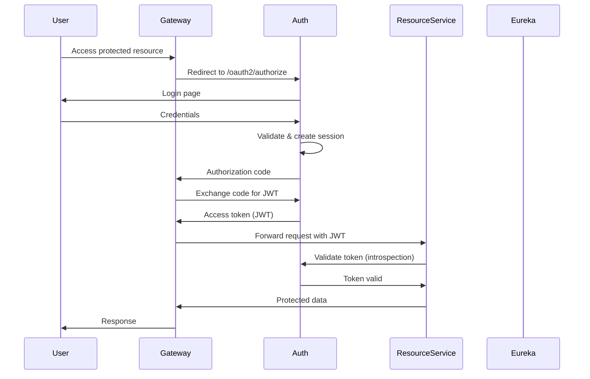

## System Architecture

SGIVU follows a microservices architecture pattern with centralized configuration management using Spring Cloud Config. The system consists of multiple specialized services that communicate through a combination of service discovery, API gateway, and OAuth2 authentication.

### Core Components

<CardGroup cols={2}>
  <Card title="Config Server" icon="gear">
    Centralized configuration management serving YAML configs from this repository
  </Card>
  <Card title="Discovery Service" icon="radar">
    Eureka-based service registry for dynamic service discovery
  </Card>
  <Card title="API Gateway" icon="door-open">
    Single entry point handling routing, OAuth2 authentication, and session management
  </Card>
  <Card title="Auth Service" icon="shield-halved">
    OAuth2 authorization server managing authentication and JWT token issuance
  </Card>
</CardGroup>

### Business Services

<CardGroup cols={2}>
  <Card title="User Service" icon="user">
    User management and profile operations (Port 8081)
  </Card>
  <Card title="Client Service" icon="users">
    Client entity management (Port 8082)
  </Card>
  <Card title="Vehicle Service" icon="car">
    Vehicle inventory with AWS S3 integration (Port 8083)
  </Card>
  <Card title="Purchase-Sale Service" icon="file-contract">
    Transaction orchestration across multiple services (Port 8084)
  </Card>
</CardGroup>

## Spring Cloud Config Architecture

### Configuration Resolution Flow

Spring Cloud Config Server exposes this repository to all microservices, allowing centralized and versioned configuration management.

<Steps>
  <Step title="Service Startup">
    Microservice starts and connects to Config Server (typically `http://sgivu-config:8888`)
  </Step>
  <Step title="Configuration Request">
    Service requests config using its `spring.application.name` and active profile (e.g., `/sgivu-auth/dev`)
  </Step>
  <Step title="Configuration Merge">
    Config Server merges base configuration (`sgivu-auth.yml`) with profile-specific overrides (`sgivu-auth-dev.yml`)
  </Step>
  <Step title="Property Resolution">
    Environment variables and placeholders are resolved (e.g., `${EUREKA_URL:http://sgivu-discovery:8761/eureka}`)
  </Step>
  <Step title="Service Configuration">
    Service receives complete configuration and initializes with resolved properties
  </Step>
</Steps>

### Configuration Layering

The repository uses a **base + override** pattern for environment-specific configuration:

**Base Configuration** (`{service}.yml`)
- Common properties shared across all environments
- Default values for placeholders
- Standard Spring Boot configuration (JPA, Flyway, Eureka)
- Service discovery and inter-service URLs
- Management and monitoring endpoints

**Profile Overrides** (`{service}-{profile}.yml`)
- Environment-specific database connections
- Profile-specific feature flags
- Debug and logging levels
- External service URLs (Angular frontend, OpenAPI docs)

#### Example: Auth Service Configuration

<CodeGroup>
```yaml sgivu-auth.yml (base)
spring:
  jpa:
    open-in-view: false
  session:
    store-type: jdbc
    jdbc:
      initialize-schema: never
      table-name: SPRING_SESSION

eureka:
  client:
    service-url:
      defaultZone: ${EUREKA_URL:http://sgivu-discovery:8761/eureka}

server:
  port: ${PORT:9000}

sgivu:
  jwt:
    keystore:
      location: ${JWT_KEYSTORE_LOCATION}
      password: ${JWT_KEYSTORE_PASSWORD}
```

```yaml sgivu-auth-dev.yml (dev override)
spring:
  datasource:
    url: jdbc:postgresql://${DEV_AUTH_DB_HOST:host.docker.internal}:5432/${DEV_AUTH_DB_NAME}
    username: ${DEV_AUTH_DB_USERNAME}
    password: ${DEV_AUTH_DB_PASSWORD}
  jpa:
    show-sql: true
    properties:
      hibernate:
        format_sql: true
  flyway:
    baseline-on-migrate: true

management:
  endpoints:
    web:
      exposure:
        include: "*"
  endpoint:
    health:
      show-details: always
```
</CodeGroup>

<Note>
Profile-specific files only contain properties that differ from the base configuration. This reduces duplication and makes environment differences explicit.
</Note>

## Service Discovery with Eureka

### Discovery Server Configuration

The Eureka server acts as the service registry for all microservices:

```yaml sgivu-discovery.yml
server:
  port: 8761

eureka:
  instance:
    hostname: host.docker.internal
  client:
    registerWithEureka: false
    fetchRegistry: false
    serviceUrl:
      defaultZone: http://${eureka.instance.hostname}:${server.port}/eureka/
```

<Info>
The discovery service runs in **standalone mode** (`registerWithEureka: false`) since it is the registry itself.
</Info>

### Client Registration Pattern

All business services register with Eureka using a consistent pattern:

```yaml
eureka:
  instance:
    instance-id: ${spring.cloud.client.hostname}:${spring.application.name}:${random.value}
  client:
    service-url:
      defaultZone: ${EUREKA_URL:http://sgivu-discovery:8761/eureka}
```

**Key Features:**
- **Dynamic Instance IDs**: Uses hostname, application name, and random value to support multiple instances
- **Environment Variable Override**: `EUREKA_URL` can be customized per deployment
- **Default Fallback**: Provides sensible defaults for Docker Compose environments

## OAuth2 Authentication Architecture

### Authorization Server (sgivu-auth)

The auth service implements Spring Authorization Server to provide:
- User authentication and session management (JDBC-backed sessions)
- OAuth2 authorization code flow
- JWT token generation using keystore-based signing
- Token introspection for resource servers

```yaml
sgivu:
  jwt:
    keystore:
      location: ${JWT_KEYSTORE_LOCATION}
      password: ${JWT_KEYSTORE_PASSWORD}
    key:
      alias: ${JWT_KEY_ALIAS}
      password: ${JWT_KEY_PASSWORD}
```

### Gateway OAuth2 Client

The gateway acts as an OAuth2 client, handling user authentication:

```yaml
spring:
  security:
    oauth2:
      client:
        registration:
          sgivu-gateway:
            provider: sgivu-auth
            client-id: sgivu-gateway
            client-secret: ${SGIVU_GATEWAY_SECRET}
            authorization-grant-type: authorization_code
            redirect-uri: "{baseUrl}/login/oauth2/code/{registrationId}"
            scope:
              - openid
              - profile
              - email
              - api
              - read
              - write
        provider:
          sgivu-auth:
            issuer-uri: ${SGIVU_AUTH_URL:http://sgivu-auth:9000}
```

### Resource Servers

Business services (user, client, vehicle, purchase-sale) validate tokens by referencing the auth service:

```yaml
services:
  map:
    sgivu-auth:
      name: sgivu-auth
      url: ${SGIVU_AUTH_URL:http://sgivu-auth:9000}
```

### Inter-Service Authentication

Services use internal secret keys for direct service-to-service communication:

```yaml
service:
  internal:
    secret-key: "${SERVICE_INTERNAL_SECRET_KEY}"
```

<Warning>
Never commit actual secrets to configuration files. Use environment variables or external secret management systems.
</Warning>

## Authentication Flow



## Service Communication Patterns

### 1. Client-to-Service (via Gateway)

External clients (Angular frontend) communicate exclusively through the API Gateway:

```
Angular App → API Gateway (8080) → Business Services
```

The gateway handles:
- OAuth2 authentication flow
- Session management (Redis-backed)
- Request routing to registered services
- CORS configuration

### 2. Service-to-Service (Direct)

Business services communicate directly using configured service URLs:

```yaml
services:
  map:
    sgivu-client:
      name: sgivu-client
      url: ${SGIVU_CLIENT_URL:http://sgivu-client:8082}
    sgivu-vehicle:
      name: sgivu-vehicle
      url: ${SGIVU_VEHICLE_URL:http://sgivu-vehicle:8083}
```

Example from purchase-sale service, which orchestrates multiple services:
- User service (8081) for user validation
- Client service (8082) for client information
- Vehicle service (8083) for vehicle data

### 3. Service-to-Discovery

All services register with and query Eureka for service discovery, enabling:
- Dynamic service location
- Load balancing across instances
- Health monitoring
- Automatic failover

## Network Topology

### Docker Compose Environment

```
┌─────────────────────────────────────────────────────────┐
│                     External Network                     │
│                                                          │
│  ┌──────────────┐                                       │
│  │ Angular App  │ ──────────┐                          │
│  │  (Port 4200) │            │                          │
│  └──────────────┘            │                          │
└──────────────────────────────┼──────────────────────────┘
                               │
                               ▼
┌─────────────────────────────────────────────────────────┐
│              Internal Docker Network (sgivu)             │
│                                                          │
│  ┌─────────────────┐         ┌──────────────────┐      │
│  │   API Gateway   │◀────────│  Discovery (8761)│      │
│  │   (Port 8080)   │         │    (Eureka)      │      │
│  └────────┬────────┘         └──────────────────┘      │
│           │                                             │
│           │  ┌────────────────────────────────┐        │
│           ├─▶│   Auth Service (9000)          │        │
│           │  │   - OAuth2 Server               │        │
│           │  │   - JWT Token Issuance          │        │
│           │  └────────────────────────────────┘        │
│           │                                             │
│           │  ┌────────────────────────────────┐        │
│           ├─▶│   User Service (8081)          │        │
│           │  └────────────────────────────────┘        │
│           │                                             │
│           │  ┌────────────────────────────────┐        │
│           ├─▶│   Client Service (8082)        │        │
│           │  └────────────────────────────────┘        │
│           │                                             │
│           │  ┌────────────────────────────────┐        │
│           ├─▶│   Vehicle Service (8083)       │        │
│           │  │   - AWS S3 Integration         │        │
│           │  └────────────────────────────────┘        │
│           │                                             │
│           │  ┌────────────────────────────────┐        │
│           └─▶│   Purchase-Sale (8084)         │        │
│              │   - Multi-service orchestration│        │
│              └────────────────────────────────┘        │
│                                                         │
│  ┌─────────────┐  ┌──────────┐  ┌──────────────┐     │
│  │ PostgreSQL  │  │  Redis   │  │  Zipkin      │     │
│  │ (Per service│  │ (Gateway)│  │  (Tracing)   │     │
│  │  databases) │  │          │  │  (9411)      │     │
│  └─────────────┘  └──────────┘  └──────────────┘     │
│                                                         │
│  ┌─────────────┐                                       │
│  │ Config Srv  │  ← Reads from sgivu-config-repo      │
│  │  (8888)     │                                       │
│  └─────────────┘                                       │
└─────────────────────────────────────────────────────────┘
                               │
                               ▼
                    ┌──────────────────┐
                    │  AWS Services    │
                    │  - S3 (Vehicles) │
                    └──────────────────┘
```

### Port Allocation

| Service | Port | Purpose |
|---------|------|---------|
| API Gateway | 8080 | External entry point |
| User Service | 8081 | User management |
| Client Service | 8082 | Client management |
| Vehicle Service | 8083 | Vehicle inventory |
| Purchase-Sale | 8084 | Transaction orchestration |
| Config Server | 8888 | Configuration distribution |
| Auth Service | 9000 | OAuth2 authorization |
| Zipkin | 9411 | Distributed tracing |
| Eureka Discovery | 8761 | Service registry |
| Redis | 6379 | Session storage |
| PostgreSQL | 5432 | Databases (per service) |

## Configuration Refresh

### Actuator Endpoints

All services expose actuator endpoints for health monitoring and configuration refresh:

```yaml
management:
  endpoints:
    web:
      exposure:
        include: health, info
  endpoint:
    health:
      show-details: never  # 'always' in dev profile
```

### Dynamic Configuration Updates

To update configuration without restarting services:

<Steps>
  <Step title="Update Configuration">
    Modify YAML files in this repository and commit changes
  </Step>
  <Step title="Notify Config Server">
    Restart the config server container or use Spring Cloud Bus (if configured)
  </Step>
  <Step title="Refresh Services">
    Send POST request to `/actuator/refresh` on each service that should reload config
  </Step>
</Steps>

```bash
# Refresh a specific service
curl -X POST http://localhost:8081/actuator/refresh
```

<Note>
In development, actuator endpoints expose all operations (`include: "*"`). In production, only essential endpoints are exposed for security.
</Note>

## Observability

### Distributed Tracing

All services integrate with Zipkin for distributed tracing:

```yaml
management:
  tracing:
    sampling:
      probability: 0.1  # Sample 10% of requests
  zipkin:
    tracing:
      endpoint: http://sgivu-zipkin:9411/api/v2/spans
```

This enables:
- Request flow visualization across services
- Performance bottleneck identification
- Error propagation tracking
- Service dependency mapping

### Logging Strategy

Logging is configured per environment:

<CodeGroup>
```yaml Base (Production)
logging:
  level:
    root: INFO
```

```yaml Development
logging:
  level:
    root: INFO
    com.sgivu.gateway.security: DEBUG
    com.sgivu.gateway.controller: DEBUG
```
</CodeGroup>

## Database Architecture

### Database-per-Service Pattern

Each business service maintains its own PostgreSQL database:

```yaml
spring:
  datasource:
    url: jdbc:postgresql://${DEV_AUTH_DB_HOST}:5432/${DEV_AUTH_DB_NAME}
    username: ${DEV_AUTH_DB_USERNAME}
    password: ${DEV_AUTH_DB_PASSWORD}
  jpa:
    hibernate:
      ddl-auto: validate  # Never auto-generate schema
  flyway:
    enabled: true
    locations: classpath:db/migration
    baseline-on-migrate: ${FLYWAY_BASELINE_ON_MIGRATE:false}
```

**Key Principles:**
- Each service owns its database schema
- Flyway manages versioned migrations
- `ddl-auto: validate` ensures schema matches expectations
- `baseline-on-migrate` enabled in dev for existing databases

### Session Storage

**Auth Service**: JDBC-backed sessions for OAuth2 state management

```yaml
spring:
  session:
    store-type: jdbc
    jdbc:
      table-name: SPRING_SESSION
      cleanup-cron: 0 */15 * * * *  # Clean up every 15 minutes
```

**API Gateway**: Redis-backed sessions for scalability

```yaml
spring:
  session:
    store-type: redis
    timeout: 1h
    redis:
      namespace: spring:session:sgivu-gateway
  data:
    redis:
      host: ${REDIS_HOST:sgivu-redis}
      port: 6379
```

## External Integrations

### AWS S3 (Vehicle Service)

The vehicle service integrates with AWS S3 for image storage:

```yaml
aws:
  s3:
    vehicles-bucket: ${AWS_VEHICLES_BUCKET}
    allowed-origins: ${AWS_S3_ALLOWED_ORIGINS}
  access:
    key: ${AWS_ACCESS_KEY}
  secret:
    key: ${AWS_SECRET_KEY}
  region: ${AWS_REGION}

spring:
  servlet:
    multipart:
      max-file-size: 10MB
      max-request-size: 100MB
```

## Best Practices

<CardGroup cols={2}>
  <Card title="Configuration Security" icon="lock">
    Never commit secrets to YAML files. Use environment variables with placeholders: `${VAR_NAME:default}`
  </Card>
  <Card title="Profile Strategy" icon="layer-group">
    Keep base configs minimal and use profile overrides only for environment-specific differences
  </Card>
  <Card title="Service URLs" icon="link">
    Use DNS names (Docker service names) rather than IPs for inter-service communication
  </Card>
  <Card title="Port Consistency" icon="network-wired">
    Maintain consistent port allocation across environments using `${PORT:default}` pattern
  </Card>
</CardGroup>

## Deployment Considerations

### Docker Compose

Services communicate using Docker network DNS resolution:
- Service name = hostname (e.g., `sgivu-auth:9000`)
- Config server accessible at `sgivu-config:8888`
- Eureka at `sgivu-discovery:8761`

### EC2 / Production

For cloud deployments:
- Override service URLs via environment variables
- Use external secret management (AWS Secrets Manager, HashiCorp Vault)
- Configure proper DNS or service mesh
- Enable SSL/TLS for inter-service communication
- Adjust Eureka hostnames for public/private IP scenarios
