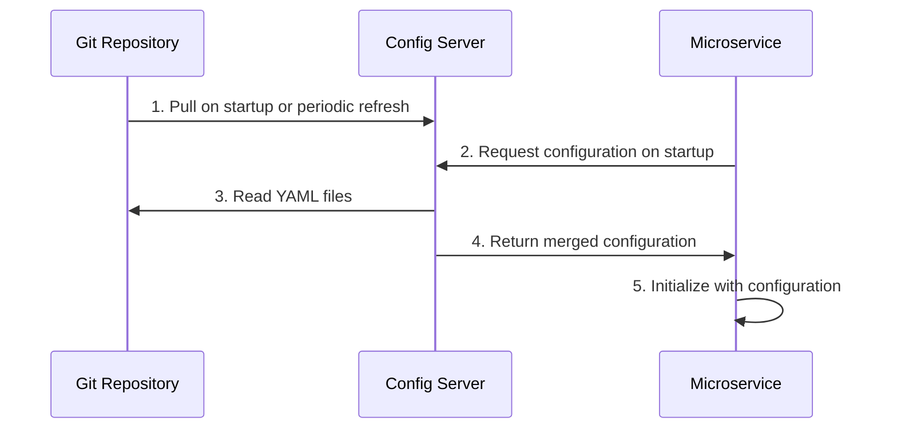

## Overview

The SGIVU Config Repository is the source of truth for all microservice configurations. Proper version control practices ensure configuration changes are tracked, reviewed, and can be rolled back if needed.

<Info>
  Configuration changes can have significant impact on running services. Treat configuration with the same care as application code.
</Info>

## Git Workflow

The repository follows a standard Git workflow with environment-specific considerations:

<Steps>
  <Step title="Create a Feature Branch">
    Always create a branch for configuration changes
    
    ```bash
    git checkout -b config/update-auth-database-settings
    ```
    
    Use descriptive branch names:
    - `config/` prefix for configuration changes
    - Service or area being modified
    - Brief description of change
  </Step>
  
  <Step title="Make Your Changes">
    Edit the appropriate YAML files:
    
    ```bash
    # Edit configuration files
    vim sgivu-auth-dev.yml
    vim sgivu-auth-prod.yml
    
    # Validate with yamllint
    yamllint *.yml
    ```
  </Step>
  
  <Step title="Commit with Descriptive Messages">
    Write clear commit messages that explain the change
    
    ```bash
    git add sgivu-auth-dev.yml sgivu-auth-prod.yml
    git commit -m "Update auth service database connection pool settings
    
    - Increase max pool size from 10 to 20 for better throughput
    - Add connection timeout of 30s to prevent hanging connections
    - Applied to both dev and prod environments"
    ```
  </Step>
  
  <Step title="Push and Create Pull Request">
    Push your branch and open a PR for review
    
    ```bash
    git push origin config/update-auth-database-settings
    ```
    
    Create a PR with:
    - Clear title describing the change
    - Detailed description of what changed and why
    - Which services and environments are affected
    - Testing performed
  </Step>
  
  <Step title="Review and Merge">
    After approval, merge to main branch
    
    ```bash
    git checkout main
    git pull origin main
    git merge --no-ff config/update-auth-database-settings
    git push origin main
    ```
  </Step>
</Steps>

## Commit Message Best Practices

### Structure

Follow this commit message format:

```text
<summary line: what changed>

<detailed description: why it changed>
- Impact on services
- Environments affected
- Any related changes
```

### Good Examples

```bash
# ✅ Good - clear and descriptive
git commit -m "Enable SQL logging in dev environment for auth service

Added show-sql and format_sql properties to aid in debugging
login issues reported by QA team. Only affects dev environment.

- sgivu-auth-dev.yml: spring.jpa.show-sql = true
- sgivu-auth-dev.yml: spring.jpa.properties.hibernate.format_sql = true"

# ✅ Good - explains security change
git commit -m "Restrict actuator endpoints in production

Limited exposed actuator endpoints to health, info, and prometheus
for security hardening. Development remains fully open for debugging.

- sgivu-gateway-prod.yml: management.endpoints.web.exposure.include
- Affects production only
- Aligns with security audit recommendations"

# ✅ Good - documents synchronization
git commit -m "Synchronize Redis configuration across all environments

Standardized Redis connection settings for gateway session storage:
- Consistent timeout: 1h
- Namespace: spring:session:sgivu-gateway
- Connection pooling parameters aligned

Affects: sgivu-gateway.yml, sgivu-gateway-dev.yml, sgivu-gateway-prod.yml"
```

### Poor Examples

```bash
# ❌ Bad - too vague
git commit -m "Update config"

# ❌ Bad - no context
git commit -m "Change database URL"

# ❌ Bad - missing why
git commit -m "Modified sgivu-auth-dev.yml"
```

<Tip>
  A good commit message answers: **What** changed, **Why** it changed, and **Where** (which services/environments) it applies.
</Tip>

## Documenting Critical Changes

From the repository conventions:

> **Documenta en PRs cambios que afecten comportamiento crítico.**

Certain configuration changes require extra documentation in pull requests:

### Critical Changes That Need Documentation

<CardGroup cols={2}>
  <Card title="Security Settings" icon="shield-halved">
    OAuth2 configuration, authentication, authorization, CORS, CSP
  </Card>
  <Card title="Database Changes" icon="database">
    Connection strings, credentials, pool sizes, schema migrations
  </Card>
  <Card title="Service Dependencies" icon="link">
    Eureka settings, service URLs, load balancing, circuit breakers
  </Card>
  <Card title="Performance Tuning" icon="gauge-high">
    Timeouts, thread pools, cache sizes, rate limits
  </Card>
</CardGroup>

### Pull Request Template Example

```markdown
## Summary
Update database connection pool settings for auth service to handle increased load

## Changes
- **sgivu-auth-dev.yml**: Increased max pool size from 10 to 20
- **sgivu-auth-prod.yml**: Increased max pool size from 10 to 30
- Added connection timeout of 30 seconds to both environments

## Motivation
QA reported slow login times during load testing. Database connection
pool was saturated under 100 concurrent users. These changes allow the
auth service to handle up to 200 concurrent connections.

## Impact
- **Services Affected**: sgivu-auth
- **Environments**: dev, prod
- **Breaking Changes**: None
- **Requires Restart**: Yes, sgivu-auth service must be restarted

## Testing
- [x] Validated YAML syntax with yamllint
- [x] Tested in local Docker environment
- [x] Load tested with 150 concurrent users in dev
- [x] Verified no connection timeout errors

## Rollback Plan
If issues occur, revert to previous commit:
```bash
git revert <this-commit-hash>
```
Or manually reduce pool size back to original values.

## Related Issues
Closes #42 - Auth service connection pool saturation
```

## Synchronizing Values Across Environments

From the repository conventions:

> **Sincroniza puertos, URLs y credenciales entre entornos.**

Certain configuration values should remain consistent across environments:

### Values to Synchronize

**Service Ports**: Keep base service ports consistent (use environment variables for overrides if needed)

```yaml
# sgivu-auth.yml (base)
server:
  port: ${PORT:9000}
```

**Service Discovery URLs**: Eureka URLs should follow the same pattern

```yaml
# All services
eureka:
  client:
    service-url:
      defaultZone: ${EUREKA_URL:http://sgivu-discovery:8761/eureka}
```

**Structural Settings**: Common Spring Boot properties should match

```yaml
# All service base files
spring:
  jpa:
    open-in-view: false
```

**Security Baselines**: Core security settings should be synchronized (with environment-specific adjustments)

```yaml
# Base: restrict by default
management:
  endpoints:
    web:
      exposure:
        include: health, info

# Dev: can be more permissive
management:
  endpoints:
    web:
      exposure:
        include: "*"
```

### Detecting Drift

Periodically compare environment configurations to detect drift:

```bash
# Compare dev and prod configurations
diff -u sgivu-auth-dev.yml sgivu-auth-prod.yml

# Or use a visual diff tool
git diff --no-index sgivu-auth-dev.yml sgivu-auth-prod.yml
```

## Testing Before Merging

Always validate configuration changes before merging:

### Local Testing with Docker Compose

<Steps>
  <Step title="Start Config Server">
    Launch the Config Server with your changes
    
    ```bash
    cd ../sgivu-docker-compose
    docker compose up -d sgivu-config
    ```
  </Step>
  
  <Step title="Verify Configuration Endpoint">
    Test that the Config Server can read your changes
    
    ```bash
    # Test dev profile
    curl http://localhost:8888/sgivu-auth/dev | jq .
    
    # Test prod profile
    curl http://localhost:8888/sgivu-auth/prod | jq .
    ```
  </Step>
  
  <Step title="Start Affected Services">
    Launch the services that use the modified configuration
    
    ```bash
    docker compose up -d sgivu-auth
    
    # Check service logs for configuration errors
    docker compose logs -f sgivu-auth
    ```
  </Step>
  
  <Step title="Functional Testing">
    Test that the services work as expected with new configuration
    
    ```bash
    # Health check
    curl http://localhost:9000/actuator/health
    
    # Test actual functionality
    # (login, API calls, etc.)
    ```
  </Step>
</Steps>

### Validation Checklist

- [ ] YAML syntax validated with `yamllint`
- [ ] Config Server can parse all files
- [ ] Services start successfully with new configuration
- [ ] No error logs related to missing or invalid properties
- [ ] Functional testing passes
- [ ] Performance meets expectations (if tuning changes)
- [ ] Security settings verified (if security changes)

## How Configuration Changes Propagate

Understanding the propagation flow helps with testing and troubleshooting:



### Propagation Methods

<Accordion title="Config Server Restart">
  **When**: Immediately applies changes by restarting the Config Server
  
  ```bash
  docker compose restart sgivu-config
  ```
  
  **Impact**: All services will get new configuration on their next restart or refresh
  
  **Use case**: Any configuration change
</Accordion>

<Accordion title="Service Restart">
  **When**: Service restarts and fetches fresh configuration from Config Server
  
  ```bash
  docker compose restart sgivu-auth
  ```
  
  **Impact**: Only the restarted service gets new configuration
  
  **Use case**: Applying changes to specific services
</Accordion>

<Accordion title="Actuator Refresh Endpoint">
  **When**: Dynamic refresh without restart (if service supports it)
  
  ```bash
  curl -X POST http://localhost:9000/actuator/refresh
  ```
  
  **Impact**: Service reloads configuration without downtime
  
  **Use case**: Non-structural changes (e.g., feature flags, logging levels)
  
  **Limitation**: Not all properties support dynamic refresh
</Accordion>

<Accordion title="Full Restart">
  **When**: Restart both Config Server and all services
  
  ```bash
  docker compose restart sgivu-config
  docker compose restart  # All services
  ```
  
  **Impact**: Complete system refresh with all new configuration
  
  **Use case**: Major configuration overhauls, troubleshooting
</Accordion>

## Rollback Strategies

When configuration changes cause issues, roll back quickly:

### Git Revert (Recommended)

Create a revert commit to undo changes:

```bash
# Find the problematic commit
git log --oneline

# Revert the commit
git revert <commit-hash>

# Push the revert
git push origin main

# Restart Config Server to apply
docker compose restart sgivu-config
```

<Info>
  Using `git revert` maintains history and makes it clear when and why a rollback occurred.
</Info>

### Emergency Manual Edit

For critical production issues, edit directly and commit:

```bash
# Edit the problematic file
vim sgivu-auth-prod.yml

# Commit the fix
git add sgivu-auth-prod.yml
git commit -m "HOTFIX: Rollback database connection pool to stable values

Reverted max pool size from 30 to 10 due to database CPU saturation.
Production auth service experiencing 500 errors.

Reverting to last known stable configuration."

git push origin main

# Restart services immediately
docker compose restart sgivu-config sgivu-auth
```

### Reset to Specific Commit

For severe issues, reset to a known-good state:

```bash
# Find the last good commit
git log --oneline

# Reset to that commit
git reset --hard <good-commit-hash>

# Force push (use with caution!)
git push --force origin main

# Restart all services
docker compose restart
```

<Warning>
  Only use `git reset --hard` and force push in emergencies. It rewrites history and can cause issues for other team members.
</Warning>

### Rollback Testing

After rollback:

```bash
# Verify configuration is loaded
curl http://localhost:8888/sgivu-auth/prod | jq .

# Check service health
curl http://localhost:9000/actuator/health

# Monitor logs
docker compose logs -f sgivu-auth

# Verify functionality
# (test login, API calls, etc.)
```

## Configuration Change Workflow Summary

<Steps>
  <Step title="Plan">
    - Identify what needs to change and why
    - Determine which environments are affected
    - Consider rollback approach
  </Step>
  
  <Step title="Implement">
    - Create feature branch
    - Edit YAML files
    - Validate with yamllint
    - Write descriptive commit messages
  </Step>
  
  <Step title="Test">
    - Test locally with Docker Compose
    - Verify Config Server can parse changes
    - Ensure services start and function correctly
  </Step>
  
  <Step title="Review">
    - Create detailed pull request
    - Document critical changes
    - Get team approval
  </Step>
  
  <Step title="Deploy">
    - Merge to main branch
    - Restart Config Server
    - Restart affected services
    - Monitor for issues
  </Step>
  
  <Step title="Verify">
    - Check service health
    - Test functionality
    - Monitor logs and metrics
    - Roll back if needed
  </Step>
</Steps>

## Best Practices Summary

1. **Use feature branches** - Never commit directly to main
2. **Write descriptive commits** - Explain what, why, and where
3. **Document critical changes** - Security, performance, and dependencies need extra detail
4. **Synchronize across environments** - Keep ports, URLs, and structures consistent
5. **Test before merging** - Validate locally with Docker Compose
6. **Understand propagation** - Know how changes reach running services
7. **Have a rollback plan** - Be ready to revert quickly if issues arise
8. **Monitor after changes** - Watch logs and metrics after deploying configuration changes
9. **Review as a team** - Configuration changes should be peer-reviewed like code
10. **Keep history clean** - Use meaningful commits and avoid force pushes unless necessary
