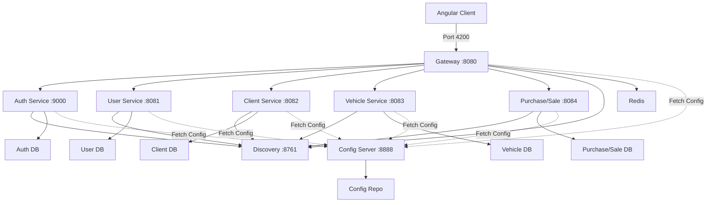

<Info>
  This guide covers local development workflows including Docker Compose setup, configuration hot-reloading, and debugging strategies.
</Info>

## Development Environment Architecture

The SGIVU platform uses a microservices architecture with the following key components:



## Setting Up with Docker Compose

The SGIVU platform uses `sgivu-docker-compose` for local orchestration. This section assumes you have access to the `sgivu-docker-compose` repository.

<Steps>
  <Step title="Clone Required Repositories">
    Clone the necessary repositories:

    ```bash
    # Config repository
    git clone <config-repo-url> ~/projects/sgivu-config-repo

    # Docker Compose orchestration
    git clone <docker-compose-repo-url> ~/projects/sgivu-docker-compose

    # Individual service repositories (as needed)
    git clone <sgivu-auth-url> ~/projects/sgivu-auth
    git clone <sgivu-gateway-url> ~/projects/sgivu-gateway
    # ... etc
    ```
  </Step>

  <Step title="Configure Environment Variables">
    Create a `.env` file in the `sgivu-docker-compose` directory with development values:

    ```bash .env
    # Database Configuration
    DEV_AUTH_DB_HOST=postgres
    DEV_AUTH_DB_PORT=5432
    DEV_AUTH_DB_NAME=sgivu_auth
    DEV_AUTH_DB_USERNAME=postgres
    DEV_AUTH_DB_PASSWORD=dev_password

    DEV_USER_DB_HOST=postgres
    DEV_USER_DB_PORT=5432
    DEV_USER_DB_NAME=sgivu_user
    DEV_USER_DB_USERNAME=postgres
    DEV_USER_DB_PASSWORD=dev_password

    DEV_CLIENT_DB_HOST=postgres
    DEV_CLIENT_DB_PORT=5432
    DEV_CLIENT_DB_NAME=sgivu_client
    DEV_CLIENT_DB_USERNAME=postgres
    DEV_CLIENT_DB_PASSWORD=dev_password

    # Redis
    REDIS_HOST=redis
    REDIS_PORT=6379
    REDIS_PASSWORD=dev_redis_password

    # Service Discovery
    EUREKA_URL=http://sgivu-discovery:8761/eureka

    # Service URLs (Docker internal)
    SGIVU_AUTH_URL=http://sgivu-auth:9000
    SGIVU_GATEWAY_URL=http://sgivu-gateway:8080
    DEV_ANGULAR_APP_URL=http://localhost:4200

    # Security
    SGIVU_GATEWAY_SECRET=dev-gateway-secret-change-in-prod
    SERVICE_INTERNAL_SECRET_KEY=dev-internal-key-change-in-prod

    # JWT Configuration
    JWT_KEYSTORE_LOCATION=classpath:keystore.jks
    JWT_KEYSTORE_PASSWORD=dev_keystore_pass
    JWT_KEY_ALIAS=sgivu-jwt
    JWT_KEY_PASSWORD=dev_key_pass

    # Flyway
    FLYWAY_BASELINE_ON_MIGRATE=true
    ```

    <Warning>
      Use strong, unique values for production environments. These are development-only values.
    </Warning>
  </Step>

  <Step title="Start Infrastructure Services">
    Start the foundational services first:

    ```bash
    cd ~/projects/sgivu-docker-compose

    # Start PostgreSQL and Redis
    docker compose up -d postgres redis

    # Wait for databases to be ready
    docker compose exec postgres pg_isready

    # Start Config Server
    docker compose up -d sgivu-config

    # Start Service Discovery
    docker compose up -d sgivu-discovery
    ```

    Verify services are healthy:

    ```bash
    # Check Config Server
    curl http://localhost:8888/actuator/health

    # Check Eureka
    curl http://localhost:8761/actuator/health
    # Or visit http://localhost:8761 in browser
    ```
  </Step>

  <Step title="Start Application Services">
    Start the microservices in dependency order:

    ```bash
    # Auth service (required by others)
    docker compose up -d sgivu-auth

    # Wait for auth to be healthy
    docker compose logs -f sgivu-auth
    # Watch for "Started SgivuAuthApplication"

    # Start other business services
    docker compose up -d sgivu-user sgivu-client sgivu-vehicle sgivu-purchase-sale

    # Start Gateway (depends on all services)
    docker compose up -d sgivu-gateway
    ```

    <Note>
      Services automatically fetch their configuration from `sgivu-config` on startup using the `dev` profile.
    </Note>
  </Step>

  <Step title="Verify the Stack">
    Check that all services are registered with Eureka:

    ```bash
    curl http://localhost:8761/eureka/apps | xmllint --format -
    ```

    Test the Gateway:

    ```bash
    # Health check
    curl http://localhost:8080/actuator/health

    # Test authentication flow (should redirect to login)
    curl -I http://localhost:8080/
    ```
  </Step>
</Steps>

## Working with Configuration Changes

One of the key advantages of Spring Cloud Config is the ability to update configuration without redeploying services.

### Making Configuration Changes

<Steps>
  <Step title="Edit Configuration Files">
    Modify the YAML files in the config repository:

    ```bash
    cd ~/projects/sgivu-config-repo

    # Edit a configuration file
    vim sgivu-auth-dev.yml
    ```

    For example, enable SQL logging:

    ```yaml sgivu-auth-dev.yml
    spring:
      jpa:
        show-sql: true
        properties:
          hibernate:
            format_sql: true
    
    logging:
      level:
        org.hibernate.SQL: DEBUG
        org.hibernate.type.descriptor.sql.BasicBinder: TRACE
    ```
  </Step>

  <Step title="Commit Changes (if using Git backend)">
    If the Config Server uses Git backend, commit your changes:

    ```bash
    git add sgivu-auth-dev.yml
    git commit -m "Enable SQL debug logging for auth service"
    git push
    ```

    <Note>
      For `native` profile (file system), changes are picked up immediately without commit.
    </Note>
  </Step>

  <Step title="Refresh Configuration">
    There are three ways to refresh configuration:

    <Tabs>
      <Tab title="Manual Refresh (Recommended for Dev)">
        Call the `/actuator/refresh` endpoint on each service:

        ```bash
        # Refresh auth service
        curl -X POST http://localhost:9000/actuator/refresh

        # Refresh gateway
        curl -X POST http://localhost:8080/actuator/refresh
        ```

        This requires `@RefreshScope` annotation on beans that use `@Value` or `@ConfigurationProperties`.
      </Tab>

      <Tab title="Restart Service">
        Restart the specific service container:

        ```bash
        docker compose restart sgivu-auth
        ```

        Services fetch fresh configuration on startup.
      </Tab>

      <Tab title="Spring Cloud Bus (Advanced)">
        Use Spring Cloud Bus with RabbitMQ or Kafka to broadcast refresh events to all services:

        ```bash
        # Trigger bus refresh (refreshes all services)
        curl -X POST http://localhost:8888/actuator/busrefresh
        ```

        Requires additional setup with message broker.
      </Tab>
    </Tabs>
  </Step>

  <Step title="Verify Changes">
    Check that the new configuration is active:

    ```bash
    # View current configuration
    curl http://localhost:8888/sgivu-auth/dev | jq '.propertySources[0].source'

    # Check service logs for confirmation
    docker compose logs -f sgivu-auth
    ```
  </Step>
</Steps>

## Development Workflows

### Hot-Reload Development Setup

For active development on a specific service:

```bash
# Stop the Docker container for the service you're developing
docker compose stop sgivu-auth

# Run the service locally with your IDE or CLI
cd ~/projects/sgivu-auth
./mvnw spring-boot:run -Dspring.profiles.active=dev

# The service will:
# - Fetch config from Config Server at http://localhost:8888
# - Connect to databases in Docker
# - Register with Eureka in Docker
# - Support hot-reload via Spring DevTools
```

<Info>
  Ensure your local service can reach Docker services. Use `host.docker.internal` or `localhost` for database connections when running locally.
</Info>

### Testing Configuration Locally

Before committing configuration changes, test them:

```bash
# 1. Make changes to config files
vi ~/projects/sgivu-config-repo/sgivu-auth-dev.yml

# 2. Validate YAML syntax
yamllint sgivu-auth-dev.yml

# 3. Test via Config Server
curl http://localhost:8888/sgivu-auth/dev | jq

# 4. Refresh the service
curl -X POST http://localhost:9000/actuator/refresh

# 5. Verify behavior
curl http://localhost:9000/actuator/env | jq '.propertySources[] | select(.name | contains("sgivu-auth"))'
```

### Debugging Configuration Issues

<Tabs>
  <Tab title="Check Config Server">
    Verify the Config Server is serving the right configuration:

    ```bash
    # Test endpoint
    curl http://localhost:8888/sgivu-auth/dev

    # Check Config Server logs
    docker compose logs sgivu-config

    # Verify Git repo is up to date (if using Git backend)
    docker compose exec sgivu-config cat /config-repo/sgivu-auth-dev.yml
    ```
  </Tab>

  <Tab title="Check Service Configuration">
    View the active configuration in a service:

    ```bash
    # View all property sources
    curl http://localhost:9000/actuator/env | jq

    # View specific property
    curl http://localhost:9000/actuator/env/spring.datasource.url | jq

    # View configuration properties beans
    curl http://localhost:9000/actuator/configprops | jq
    ```
  </Tab>

  <Tab title="Check Logs">
    Enable debug logging for Spring Cloud Config:

    ```yaml
    logging:
      level:
        org.springframework.cloud.config: DEBUG
        org.springframework.boot.context.properties: DEBUG
    ```

    Then check logs:

    ```bash
    docker compose logs -f sgivu-auth | grep -i config
    ```
  </Tab>
</Tabs>

## Common Development Tasks

### Adding a New Environment Variable

<Steps>
  <Step title="Add to Configuration File">
    ```yaml sgivu-auth-dev.yml
    my-service:
      new-feature:
        enabled: ${MY_NEW_FEATURE_ENABLED:false}
        timeout: ${MY_FEATURE_TIMEOUT:5000}
    ```
  </Step>

  <Step title="Add to .env File">
    ```bash .env
    MY_NEW_FEATURE_ENABLED=true
    MY_FEATURE_TIMEOUT=10000
    ```
  </Step>

  <Step title="Restart or Refresh Service">
    ```bash
    docker compose restart sgivu-auth
    ```
  </Step>
</Steps>

### Switching Between Profiles

Change the active profile for a service:

```yaml docker-compose.yml
services:
  sgivu-auth:
    environment:
      - SPRING_PROFILES_ACTIVE=prod  # Change from 'dev' to 'prod'
```

Or for local runs:

```bash
./mvnw spring-boot:run -Dspring.profiles.active=prod
```

### Using Different Database Schemas

For testing migrations or schema changes:

```yaml sgivu-auth-dev.yml
spring:
  flyway:
    baseline-on-migrate: true
    clean-disabled: false  # Allow cleaning database in dev
  jpa:
    hibernate:
      ddl-auto: validate  # or 'update' for auto-schema changes (not recommended)
```

```bash
# Clean and recreate database
docker compose exec postgres psql -U postgres -c "DROP DATABASE sgivu_auth;"
docker compose exec postgres psql -U postgres -c "CREATE DATABASE sgivu_auth;"
docker compose restart sgivu-auth
```

## Troubleshooting

### Configuration Not Loading

**Symptoms:** Service starts with default values, ignoring Config Server.

**Solutions:**
- Verify `bootstrap.yml` or `bootstrap.properties` exists and specifies Config Server URI
- Check `spring.application.name` matches configuration file name
- Ensure Config Server is running and healthy
- Check network connectivity between service and Config Server
- Look for errors in service startup logs

```bash
# Check service can reach Config Server
docker compose exec sgivu-auth curl http://sgivu-config:8888/actuator/health
```

### Environment Variables Not Resolving

**Symptoms:** Configuration contains `${VARIABLE}` literals or services fail to start.

**Solutions:**
- Verify variables are defined in `.env` file
- Check Docker Compose is loading the `.env` file
- Ensure variables are passed to containers in `docker-compose.yml`
- Use `docker compose config` to view resolved configuration

```bash
# View resolved Docker Compose configuration
docker compose config | grep -A 5 sgivu-auth

# Check environment variables in running container
docker compose exec sgivu-auth env | grep DEV_
```

### Services Not Registering with Eureka

**Symptoms:** Services don't appear in Eureka dashboard.

**Solutions:**
- Verify Eureka URL is correct in configuration
- Check `eureka.client.enabled` is not set to `false`
- Ensure network connectivity to Discovery service
- Check for errors in service logs related to Eureka

```bash
# Check Eureka dashboard
open http://localhost:8761

# Check Eureka apps via API
curl http://localhost:8761/eureka/apps/SGIVU-AUTH | xmllint --format -
```

### Database Connection Failures

**Symptoms:** Services fail to start with connection errors.

**Solutions:**
- Verify database containers are running: `docker compose ps postgres`
- Check database credentials in `.env` file
- Ensure databases exist: `docker compose exec postgres psql -U postgres -l`
- Test connection manually:

```bash
# Test database connection
docker compose exec postgres psql -U postgres -d sgivu_auth -c "SELECT 1;"

# Check database logs
docker compose logs postgres
```

### Redis Connection Issues (Gateway)

**Symptoms:** Gateway fails to start or sessions don't persist.

**Solutions:**
- Verify Redis is running: `docker compose ps redis`
- Check Redis credentials match configuration
- Test Redis connection:

```bash
# Test Redis connection
docker compose exec redis redis-cli -a "${REDIS_PASSWORD}" ping

# View Redis keys
docker compose exec redis redis-cli -a "${REDIS_PASSWORD}" keys "spring:session:*"
```

## Performance Tips

### Reduce Startup Time

- Use selective service startup (only start services you need)
- Disable unnecessary features in development:
  ```yaml
  management:
    tracing:
      enabled: false  # Disable Zipkin tracing
  ```
- Use faster database DDL validation:
  ```yaml
  spring:
    jpa:
      hibernate:
        ddl-auto: none  # Skip schema validation
    flyway:
      enabled: false  # Skip migrations if DB is already migrated
  ```

### Optimize Docker Performance

- Allocate sufficient resources to Docker (8GB+ RAM recommended)
- Use volume mounts for faster I/O
- Consider using `docker compose up --no-recreate` to avoid container recreation

## Next Steps

<CardGroup cols={2}>
  <Card title="Configuration Reference" icon="book" href="/reference/spring-configuration">
    Explore detailed configuration options for each service
  </Card>
  <Card title="Service Architecture" icon="diagram-project" href="/architecture">
    Understand the microservices architecture and dependencies
  </Card>
  <Card title="Service Overview" icon="server" href="/services/overview">
    Explore all configured microservices
  </Card>
  <Card title="Environment Management" icon="layer-group" href="/environments/overview">
    Manage dev, prod, and custom environments
  </Card>
</CardGroup>
