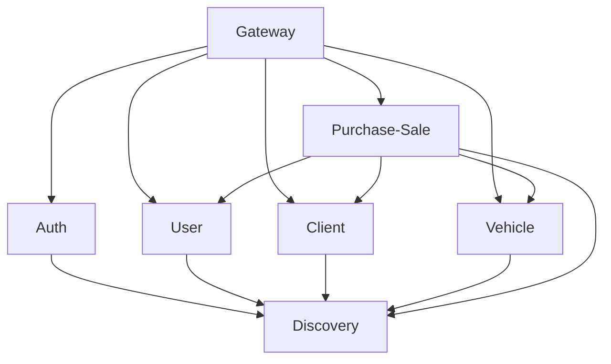

The SGIVU platform consists of multiple microservices, each with its own configuration managed through Spring Cloud Config. This page provides an overview of all services and common configuration patterns.

## Service Architecture

<CardGroup cols={2}>
  <Card title="Auth Service" icon="shield-halved" href="/services/auth">
    OAuth2/OIDC authorization server on port 9000
  </Card>
  <Card title="Gateway Service" icon="door-open" href="/services/gateway">
    API Gateway with session management on port 8080
  </Card>
  <Card title="Discovery Service" icon="compass" href="/services/discovery">
    Eureka service registry on port 8761
  </Card>
  <Card title="User Service" icon="user" href="/services/user">
    User management microservice on port 8081
  </Card>
  <Card title="Client Service" icon="users" href="/services/client">
    Client management microservice on port 8082
  </Card>
  <Card title="Vehicle Service" icon="car" href="/services/vehicle">
    Vehicle catalog with S3 integration on port 8083
  </Card>
  <Card title="Purchase-Sale Service" icon="handshake" href="/services/purchase-sale">
    Transaction orchestration service on port 8084
  </Card>
</CardGroup>

## Service Port Allocation

| Service | Port | Purpose | Database |
|---------|------|---------|----------|
| **sgivu-auth** | 9000 | OAuth2 Authorization Server | PostgreSQL |
| **sgivu-gateway** | 8080 | API Gateway & Session Management | Redis |
| **sgivu-discovery** | 8761 | Eureka Service Registry | None |
| **sgivu-user** | 8081 | User Management | PostgreSQL |
| **sgivu-client** | 8082 | Client Management | PostgreSQL |
| **sgivu-vehicle** | 8083 | Vehicle Catalog & AWS S3 | PostgreSQL |
| **sgivu-purchase-sale** | 8084 | Transaction Orchestration | PostgreSQL |

## Common Configuration Patterns

### Eureka Service Discovery

Most services register with Eureka for service discovery:

```yaml
eureka:
  instance:
    instance-id: ${spring.cloud.client.hostname}:${spring.application.name}:${random.value}
  client:
    service-url:
      defaultZone: ${EUREKA_URL:http://sgivu-discovery:8761/eureka}
```

<Info>
The `instance-id` includes a random value to support multiple instances of the same service.
</Info>

### Database Configuration

All data services use PostgreSQL with Flyway migrations:

<Tabs>
  <Tab title="Development">
    ```yaml
    spring:
      datasource:
        url: jdbc:postgresql://${DEV_*_DB_HOST:host.docker.internal}:${DEV_*_DB_PORT:5432}/${DEV_*_DB_NAME}
        username: ${DEV_*_DB_USERNAME}
        password: ${DEV_*_DB_PASSWORD}
      jpa:
        hibernate:
          ddl-auto: validate
        show-sql: true
      flyway:
        baseline-on-migrate: true
        clean-disabled: false
    ```
  </Tab>
  <Tab title="Production">
    ```yaml
    spring:
      datasource:
        url: jdbc:postgresql://${PROD_*_DB_HOST}:${PROD_*_DB_PORT}/${PROD_*_DB_NAME}
        username: ${PROD_*_DB_USERNAME}
        password: ${PROD_*_DB_PASSWORD}
      jpa:
        hibernate:
          ddl-auto: validate
      flyway:
        clean-disabled: true
        baseline-on-migrate: ${FLYWAY_BASELINE_ON_MIGRATE:false}
    ```
  </Tab>
</Tabs>

<Warning>
Production environments have `clean-disabled: true` to prevent accidental database deletion.
</Warning>

### Service-to-Service Authentication

All microservices use a shared secret for internal API calls:

```yaml
service:
  internal:
    secret-key: "${SERVICE_INTERNAL_SECRET_KEY}"
```

<Note>
This secret must be the same across all services to enable secure service-to-service communication.
</Note>

### Distributed Tracing

All services integrate with Zipkin for distributed tracing:

```yaml
management:
  tracing:
    sampling:
      probability: 0.1  # Sample 10% of requests
  zipkin:
    tracing:
      endpoint: http://sgivu-zipkin:9411/api/v2/spans
```

### Service Registry Pattern

Services maintain a map of other services they depend on:

```yaml
services:
  map:
    sgivu-auth:
      name: sgivu-auth
      url: ${SGIVU_AUTH_URL:http://sgivu-auth:9000}
```

### Actuator Endpoints

<Tabs>
  <Tab title="Development">
    ```yaml
    management:
      endpoints:
        web:
          exposure:
            include: "*"  # All endpoints exposed
      endpoint:
        health:
          show-details: always
    ```
  </Tab>
  <Tab title="Production">
    ```yaml
    management:
      endpoints:
        web:
          exposure:
            include: health, info, prometheus
      endpoint:
        health:
          show-details: never  # Hide internal details
    ```
  </Tab>
</Tabs>

### OpenAPI Documentation

Each service exposes its API documentation through the gateway:

```yaml
springdoc:
  swagger-ui:
    url: /docs/{service-name}/v3/api-docs
    configUrl: /docs/{service-name}/v3/api-docs/swagger-config
```

## Environment Variables

### Common to All Services

- `SERVICE_INTERNAL_SECRET_KEY` - Shared secret for service-to-service authentication
- `EUREKA_URL` - Eureka server URL (default: `http://sgivu-discovery:8761/eureka`)
- `PORT` - Service port (overrides default)

### Profile-Specific

Each service requires database credentials for its profile:

**Development:**
- `DEV_{SERVICE}_DB_HOST`
- `DEV_{SERVICE}_DB_PORT`
- `DEV_{SERVICE}_DB_NAME`
- `DEV_{SERVICE}_DB_USERNAME`
- `DEV_{SERVICE}_DB_PASSWORD`

**Production:**
- `PROD_{SERVICE}_DB_HOST`
- `PROD_{SERVICE}_DB_PORT`
- `PROD_{SERVICE}_DB_NAME`
- `PROD_{SERVICE}_DB_USERNAME`
- `PROD_{SERVICE}_DB_PASSWORD`

## Configuration Layering

Spring Cloud Config uses a three-tier configuration strategy:

1. **Base configuration** (`{service-name}.yml`) - Common settings across all environments
2. **Profile configuration** (`{service-name}-{profile}.yml`) - Environment-specific overrides
3. **Environment variables** - Runtime overrides

<Accordion title="Configuration Resolution Order">
Spring Boot resolves configuration in this order (higher priority wins):

1. Environment variables
2. Profile-specific YAML (`-dev`, `-prod`)
3. Base YAML file
4. Application defaults

This allows you to set defaults in the base config and override them per environment.
</Accordion>

## Service Dependencies



## Next Steps

<CardGroup cols={2}>
  <Card title="Auth Service" icon="shield-halved" href="/services/auth">
    Configure OAuth2 authorization
  </Card>
  <Card title="Gateway Service" icon="door-open" href="/services/gateway">
    Set up API gateway and routing
  </Card>
  <Card title="Discovery Service" icon="compass" href="/services/discovery">
    Configure service registry
  </Card>
  <Card title="Business Services" icon="briefcase" href="/services/user">
    Configure microservices
  </Card>
</CardGroup>
